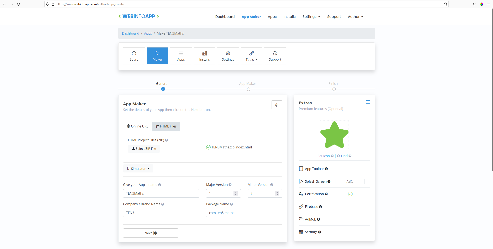
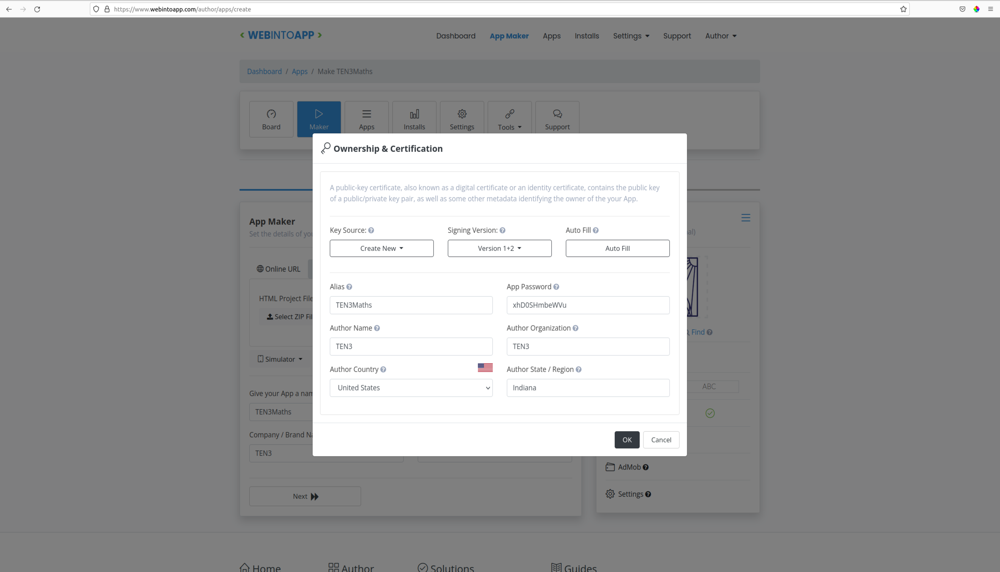
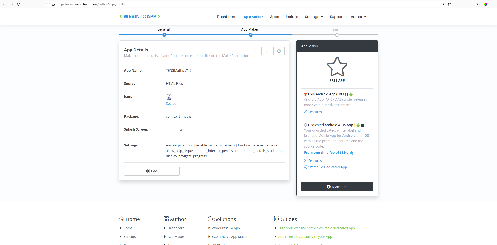

# Ten3Maths
Developers: [Tessa D'Souza](https://www.linkedin.com/in/tessa-dsouza/), [Daniel Robb](https://www.linkedin.com/in/daniel-r-055a20211/)

Developers Emeritus: [Catherine Bell](https://www.linkedin.com/in/catherine-bell-4aa324260/), [Jared Winkens](https://www.linkedin.com/in/jared-winkens-68b764237/)

## Introduction
The TEN3Maths app is meant to provide mathematics practice problems to students in Kindergarten through Grade 5 on many different Android devices and browsers. Learn more about TEN3 and the educational work they do at [ten3.org](https://owls.technology:9213/JSPWiki/).

## Grade-Level Notes
On the starting page, the app prompts the user to select a grade level, then redirects them to choose an operation (+, -, ×, or ÷) before starting the game. At any point during the game, the user can change grades by returning to the home screen using the top left corner, or change operations by clicking the operations menu in the top right corner

The following grade-level expectations are based on Singaporean research of mathematics for primary school-aged children. Keep in mind that some problems will be easy enough for a student to calculate mentally, but others might be difficult enough that a student would want to write, draw, or use physical objects to reason throught the problem. We recommend having students work until they have answered 7-8 of the last 10 problems correctly.

### Kindergarten
Kindergarteners focus on learning how to "make" and "break" the number 10 through addition and subtraction problems. The answer should never be more than 11, which helps them understand how 10, and every number under it, combine to form other numbers.

Additionally, kindergarten should use 10-frames to show the numbers visually, which helps students understand the relationships between different numbers. This is not yet implemented, but there are some notes in the **Pictorial Mode** section of this document.

### Grade 1
In Grade 1, students add and subtract numbers up to 40. This allows them to work with multiple place values without exceeding their readiness. 
### Grade 2
In Grade 2, students can add and subtract sums up to 1001, introducing them to three-digit numbers. They do *not* yet work with negative numbers, and they are still restricted to addition and subtraction.
### Grade 3
In Grade 3, students use the same addition and subtraction settings as Grade 2, but are also introduced to multiplication and division. Multiplication and division equations will not have any numbers greater than 196 (the square of 14). It is also developmentally appropriate for Grade 3 students to work with addition and subtraction of fractions, but we have not implemented features for that into the app.
### Grade 4
Grade 4 is functionally the same as Grade 3, but multiplication and division goes up to 1024 (the square of 32). It would be developmentally appropriate to introduce decimals (as small as 0.01) and to multiply and divide fractions, but we have not implemented that as a feature at this point.
### Grade 5
In Grade 5, students are capable of interacting with negative sums, so they have access to addition and subtraction from -1001 to 1001. Additionally, they can multiply and divide positive numbers up to 1024. It would be developmentally appropriate to perform operations on both fractions and decimals, but this is not implemented currently.


## End User Installation


**DJR add link or delete**
### Internet
Open the source code hosted on ten3.org and play in the browser by clicking [here]. To start a new session (reset the game), simply open the link again.

### Offline Browser
To use from a PC Offline, download the zip file of the most recent version:
**DJR correct this**
[link to zip file download]
Unpack the zip file and open "index.html" in your browser. To reset the session data, simply reopen index.html.

### Android
From a computer or over the internet, move the APK to the downloads file, then open it to install and launch the mobile application.

Here is how to move the `TEN3Maths.apk` file onto your Android device. 
1. If you have the `.apk` file on a thumb drive, you will need to transfer it to a computer first. 
2. Once the `.apk` file is on your computer, you can connect your Android device to the computer using a charging cord. 
3. You may need to enable File Transferring on your device. Here's how:
    - Drag down from the top of the screen, to where you would see any notifications you have.
    - There should be a notification at the bottom that says something like "Chargin this device via USB." Tap on this twice, so it takes you to More Options.
    - Under the "Use USB for" section, select "File transfer / Android Auto". This will allow you to access the files on your Android device from your connected computer.
4. You should be able to open a window on your computer to access the device's files. On the computer, find your connected Android device's name in your file browser and open it. Open the folder called `Downloads` (you may need to open a folder called `DCIM` first).
5. Drag the `.apk` file from your computer into the Downloads folder of the device. 
5. Once the `.apk` file is transferred, you can disconnect your device from the computer.
6. Open your device's Files program, and go to the Downloads folder.
7. The `TEN3Maths.apk` file should be at the top. You can tap on it to begin installing the app.
8. Your device will probably ask you if you want to install the app. Tap "Install".
9. Your device may stop you with a message that says something like "For your security, your phone currently isn't allowed to install unknown apps from this source. You can change this in Settings." This is good! You should never install an app from someone you don't trust. To install our Maths app, you can tap "Settings". This will take you to a page which asks if you want to "Allow from this source." Tap on the toggle switch on the right, and it will allow you to install TEN3's Maths app. (If it does not prompt you to install the app immediately, you can go back to your Downloads folder and tap `TEN3Maths.apk`, and it should restart the installation.)
10. After a few moments, the `TEN3Maths` app should be installed on your device!
11. If your device prompts you to open the app, you can tap "Open" to open the app. If it doesn't offer to open the app, you can find it among your other apps by swiping up from the bottom of your home screen and searching for it.

### iOS

For an iOS vrsion, we used [Cordova](https://cordova.apache.org/) to create an iOS app.

On a Mac with Xcode, run the following:
```
$ npm install -g cordova
$ cordova create TEN3Maths
$ cd TEN3Maths
```

Now, replace the files in the 'www' directory with the TEN3Maths source code, then run:

```
$ cordova platform add browser
$ cordova run browser
```
This will bring up the app in an iOS simulator. From Xcode, install the app on any iOS device you want.

Unfortunately, while Apple does offer free developer licenses to non-profits with 501c3 status, and allows users to [deploy an app](https://support.apple.com/guide/deployment/distribute-proprietary-in-house-apps-depce7cefc4d/web) to users without putting it in the App Store, the stringent developer certificate authentication process prevents apps developed in the USA on non-profit or internal-use licenses to be deployed in Africa. As it stands now, in order to deploy the app in Africa, the Cordova setup process will have to be replicated with the source code and deployed locally in each new country.


## Setting Up Dev Environment

Because this app only uses HTML, JavaScript, and CSS, all you need is a web browser and an IDE. We developed on Chrome and Firefox while editing in VSCode.

### Building an APK

We used a free online service (webintoapp.com) to turn our source code into an APK. Go to [this link](https://www.webintoapp.com/author/apps/create) to get started. You will need to create a (free) account to use the service.

Compress all files (html, js, css, and any assets) into a `.zip` file to upload to the service. NOTE: Don't put them all in a folder and then zip *that;* the `index.html` file must be at the top level of the `.zip`!

Select the "HTML Files" option and upload the `.zip` file containing all source code. Our last build was version 1.7, so future builds should start at 1.8. We chose to name the app, company, and package as shown in this image, but these can be changed in the future if desired.



Under the green star, click "Set Icon" and upload the file called `TEN3Icon.png` in the `assets/` folder of the source code.

Below that, click the "App Toolbar" button. In the popup, deselect the "Enable App Toolbar" option.

Ignore the "Splash Screen" option.

Match the Alias, Author Name, and Author Organization shown here:



Ignore the "Firebase" and "AdMob" options.

Click on the "Settings" option. In the General tab, leave all presets the way they are except for "Clear Cache On Exit", which you should turn on. In the Advanced tab, choose "Portrait" for the Screen Orientation option. Click Ok.

All your settings should be correct now, so you can click the "Next" button at the bottom. Review the App Details to see that everything is in order. Click "Make App" on the right.



After a few moments, it'll prompt you about your "App Homepage." Deselect the toggle switch; we don't need a homepage. Click Ok.

You should be at your dashboard now, with a list of your apps. Click the download button to the right of the one you just created and choose the free option to download all the files as a `.zip`. You can extract the files from this `zip`, and navigate to the `android` folder inside. Your `apk` is there, called `app-release.apk`, but you can change the `.apk` file name to whatever you want. The app it installs will have the name you specified when building it on the site no matter what the `.apk` is called.

## Known Issues
### Skipping Questions Workaround
A sneaky user can skip a hard question without it showing as "skipped" in their track record by simply going back to the "operation selection" screen and re-entering the game from there, as the app generates a new question for them.


## Unimplemented Features
### Decimal and Fraction Modes
As stated above, students in Grades 3-5 would benefit from opportunities to practice fractions, and students in Grades 4-5 should be familiarized with decimals. In only 15 days of development, fractions and decimals are a bit tricky to implement, so we did not build out problem-generation logic for either, and didn't make UI choices for displaying and interacting with fractions. Adding fraction and decimals would be a top priority for future versions.

### Compare Mode
One major feature of the written curriculum and early mathematics education is the practice of comparison. For Grades K-2, it would be helpful for students to answer questions like "which of these is bigger" (Kindergarten), "which of these numbers is the smallest" (Grade 1), and "select the symbol that best describes the relationship between these numbers" (Grade 2). For these kinds of questions, the generated numbers would be shown as buttons for younger students, and older students would be shown two numbers with the answer box between them and the number keyboard would be replaced with the following symbols:  <, >, ≤, ≥, =

### Pictorial Mode
Pictorial mode would be a much better learning tool for Kindergarten than what we currently have. Problems would look somewhat this:


### Time Mode
Much like Compare Mode, the app currently doesn't have features for calendar and clock math. Time mode could range from telling the time from a generated clock face to questions like "This clock shows that it's 2:13. How many minutes until 2:30?"

### Save Files
Currently, a user's data is only as persistent as their browser session, meaning that as long as the app is open in the same tab (when playing in browser) or the same session of the app (when run from the APK), it will remember their progress, but as soon as this session is closed, it will forget all of their progress. A simple way to make it possible to save progress for multiple users across sessions would be to create save files and CRUD functionality so that a user's progress could be tracked (and even limited) based on their identity.

## Session "Track Record"
While this feature *is* currently implemented, we believe it is underdeveloped as of now. The current version of this feature displays symbols to represent the user's performance over the last 10 questions they've attempted. This shows whether each problem was answered correctly or incorrectly, and if it was incorrect, whether they tried the same problem again or chose to skip to the next one.

### Incentivization
We received feedback on the existing app that it seems that there is nothing the user is *working toward*. At least in the West, we are accustomed to some sort of goal when we work through problems, and probably a reward of sorts along the way. The current version of the app has no end to the questions—it will keep generating more until the user opts to finish playing. We feel the questions could be presented as sets of 20 or so at a time, and/or that once a streak of 10 in a row are answered correctly, there could be a special popup or symbol that appears to congratulate them.

### Revisiting Skipped Questions
We also received feedback that it would be nice to have the option to return to skipped questions to try them again by tapping on the icon in the Track Record, and having the app re-load that problem, giving the user another chance to get it right.


### Session Overview
To give more information about a student's progress over an entire sessions, it would be helpful for teachers and students if there was a small grid that looked like this:


| *Pictorial progress*| C: 10   | I: 4    |
|---------------------|---------|---------|
| *goes in this area*| S: 6    | Q: 20   |

It represents the count of correct answers, incorrect answers, skipped questions, and total questions. It's attached to the right of the current pictorial progress box to communicate that it's a part of the overall session performance data.
